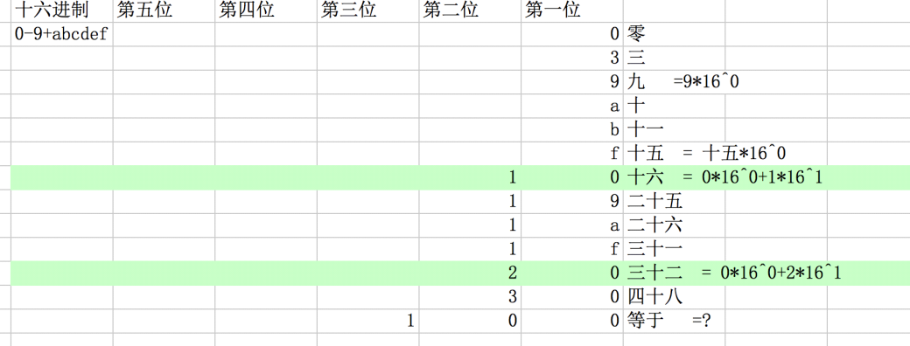

# 进制

## 1、什么是进制

### 1）理解个X进制的概念 :
每一位 只允许出现 0~X-1 这几个数字,逢X进一,基是X, 每一位有一个权值大小是X的幂次。 其表示的数值可以写成按位权展开的多项式之和。

十进制: 
	每一位只允许出现0~9这十个数字,逢十进1,基是十,每一位数字有一个 权值大小是十的幂次。
	其表示的数值可以写成按位权展开的多项式之和。
	


二进制: 
	每一位只允许出现0~1这二个数字,逢二进1,基是 二,
	每一位数字有一个权值大小是二的幂次。 其表示的数值可以写成按位权展开的多项式之和。
	


八进制:
	


十六进制
	



### 2）
假如用两个字节表示 一个整数，
如下：
```
	十进制数字1 的二进制表现形式: 0000 0000 0000 0001
	十进制数字2 的二进制表现形式: 0000 0000 0000 0010
```
如何表示二进制数的正负？

### 3）有符号数和无符号数的概念

规则：把二进制数中的最高位（最左边的那位）用作符号位
```
	对于有符号数，最高位被计算机系统规定为符号位(0为正,1为负)
	对于无符号数，最高位被计算机系统规定为数据位
```
按照这种说法，比如有符号数 +2  -2 的原码形式：
```
+2 = 0000 0000 0000 0010
-2 = 1000 0000 0000 0010
真值      机器数
```
```
+1 = 0000 0000 0000 0001
-1 = 1000 0000 0000 0001
-----------------------------------------
	   1000 0000 0000 0010
```
-1+1 的结果？

-1+1 = 1000 0000 0000 0010 ----》 -2

不等于0，按理说-1+1等于0才对，为什么会是-2呢？

### 规则

> 数字在计算机中，是用二进制补码的形式来保存的，因此-1 +1需要按照补码进行相加才是正确的结果

## 2、原码、反码、补码

### 1）如何计算补码？
```
规则:
正数：原码 = 反码 = 补码
负数：反码 = 符号位不变，其他位取反
	 补码 = 反码+1
```

```
1 的原码：0000 0000 0000 0001
-1的原码：1000 0000 0000 0001
-1的反码：1111 1111 1111 1110
-1的补码：1111 1111 1111 1111
```

重新计算 -1+1 结果
```
1111 1111 1111 1111
0000 0000 0000 0001
---------------------------
0000 0000 0000 0000
```


### 2）从补码转回原码

负数补码转换原码的规则:
```
原码 = 补码的符号位不变 -->数据位取反--> 尾+1
-1的补码:1111 1111 1111 1111
	取反:1000 0000 0000 0000
-1的原码:1000 0000 0000 0001
```

### 【了解】
可以把减法用加法来算，只需设计加法器就好了。运算的时候都是用补码去运算的。
2-1 = 2+(-1)=0000 0000 0000 0010 +1111 1111 1111 1111

### 【了解】
为何要使用原码, 反码和补码
既然原码才是被人脑直接识别并用于计算表示方式, 为何还会有反码和补码呢?
首先, 因为人脑可以知道第一位是符号位, 在计算的时候我们会根据符号位, 选择对应加减，但是对于计算机，加减乘数已经是最基础的运算, 要设计的尽量简单。计算机辨别"符号位"显然会让计算机的基础电路设计变得十分复杂！于是人们想出了将符号位也参与运算的方法.
 我们知道，根据运算法则减去一个正数等于加上一个负数, 即: 1-1 = 1 + (-1) = 0 , 所以机器可以只有加法而没有减法, 这样计算机运算的设计就更简单了.于是人们开始探索 将符号位参与运算, 并且只保留加法的方法
