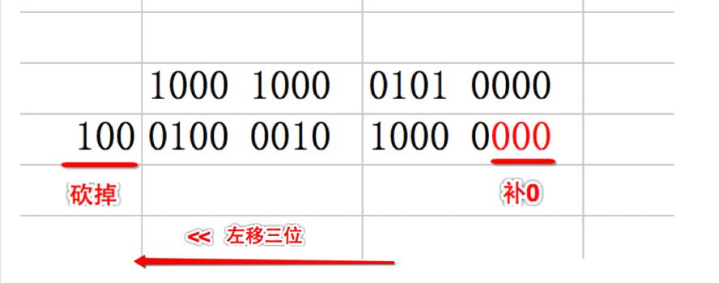
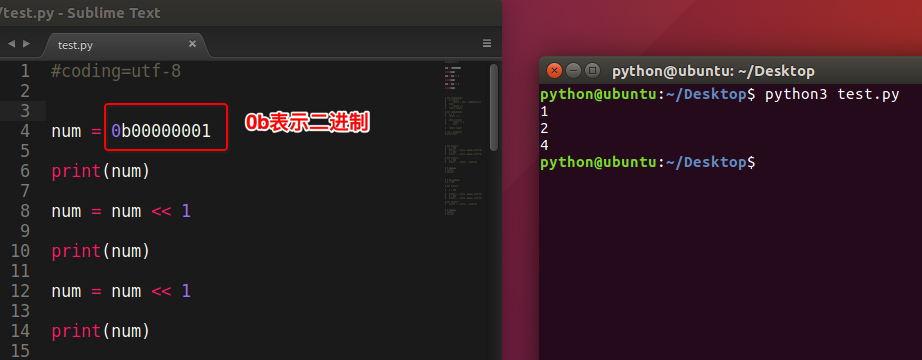
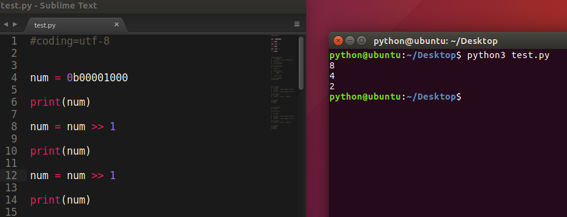

# 位运算

## 看如下示例:
 >如果有一个十进制数 5，其二进制为:`0000 0101`
 >
 >把所有的数向左移动一位 其结果为: `0000 1010`
 >
 >想一想:二进制 0000 1010 十进制是多少呢？？？其答案为10，有没有发现是5的2倍呢！
 >
 >再假设有一个十进制数 3， 其二进制 为:`0000 0011`
 >
 >把所有的数向左移动一位 其结果为:		`0000 0110`
 >
 >二进制0000 0110 的十进制为6，正好也是3的2倍

通过以上2个例子，能够看出，把一个数的各位整体向左移动一个位，就变成原来的2倍

那么在Python中，怎样实现向左移动呢？还有其他的吗？？？

## <1>位运算的介绍
 * & 按位与
 * | 按位或
 * ^ 按位异或
 * ~ 按位取反
 * << 按位左移
 * \>\> 按位右移

 用途: 直接操作二进制,省内存,效率高

## <2>位运算
### 1）<< 按位左移
	各二进位全部左移n位,高位丢弃,低位补0
	

	x << n 左移 x 的所有二进制位向左移动n位,移出位删掉,移进的位补零

### 【注意事项】

* a. 左移1位相当于 乘以2
* 用途:快速计算一个数乘以2的n次方 (8<<3 等同于8*2^3)
	

b.左移可能会改变一个数的正负性
	

	

### 2)>> 右移
	各二进位全部右移n位,保持符号位不变
	
	x >> n x的所有二进制位向右移动n位,移出的位删掉,移进的位补符号位 右移不会改变一个数的符号

### 【注意事项】
* 右移1位相当于 除以2		
* x 右移 n 位就相当于除以2的n次方 用途:快速计算一个数除以2的n次方 (8>>3 等同于8/2^3)
		
	

	

### 3)& 按位与
	全1才1否则0 :只有对应的两个二进位均为1时,结果位才为1,否则为0
	用6和3这个例子。不要用9 和13的例子

	

### 4) | 按位或
	有1就1 只要对应的二个二进位有一个为1时,结果位就为1,否则为0
	

### 5) ^ 按位异或
	不同为1 当对应的二进位相异(不相同)时,结果为1,否则为0

### 6) ~ 取反

~9 = -10

【为什么9取反变成了-10的说明】：

9的原码 ==> 0000 1001 因为正数的原码=反码=补码，所以在 真正存储的时候就是0000 1001

接下来进行对9的补码进行取反操作

进行取反==> 1111 0110  这就是对9 进行了取反之后的补码

既然已经知道了补码，那么接下来只要转换为 咱们人能识别的码型就可以，因此按照规则 ，把这个1111   0110 这个补码 转换为原码即可
   
符号位不变，其它位取反==> 1000  1001

然后+1 ，得到原码   =======>1000 1010   这就是 -10
  
### 【扩展】

 1)任何数和1进行&操作,得到这个数的最低位 数字&1 = 数字的二进制形式的最低位
 
 2)位运算优先级

